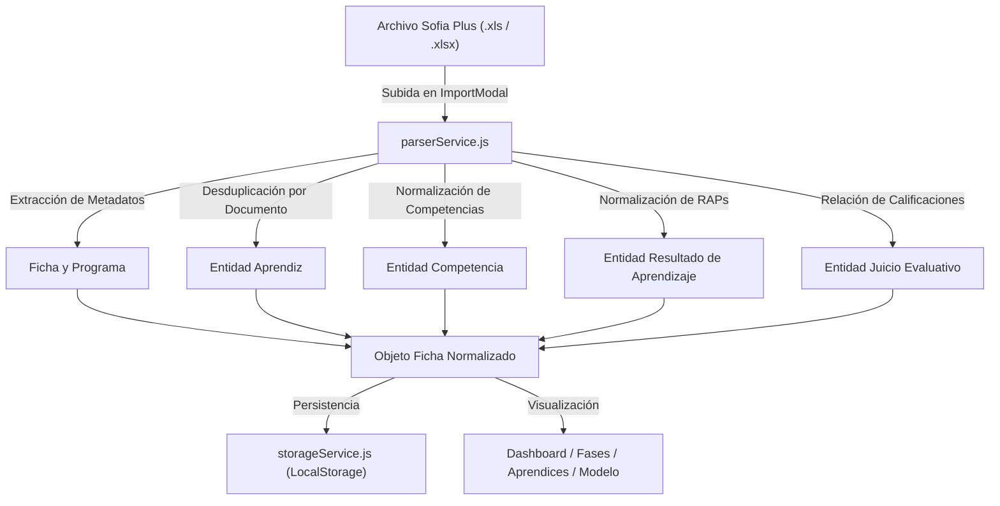

# Arquitectura General del Sistema

## 1. Visión y Propósito
El **Sistema de Gestión y Normalización de Juicios Evaluativos SENA** fue desarrollado en respuesta a la guía de aprendizaje `GA-220501096-95-94-93-92 - Práctico 1`. Su objetivo es transformar sábanas planas de datos generadas por la plataforma Sofia Plus en una estructura relacional en **Tercera Forma Normal (3FN)**, facilitando la analítica académica, el seguimiento formativo y el control de fases curriculares.

---

## 2. Patrón de Arquitectura: Feature-Sliced Layered Architecture
La solución utiliza una separación modular que combina el empaquetado por características (*features*) con capas de servicio desacopladas (*services*):

```
src/
├── components/layout/        # Capa de presentación compartida (Header, Footer)
├── constants/                # Definiciones inmutables de negocio y esquemas
├── data/                     # Datos iniciales precargados (Ganadería y Contable)
├── features/                 # Módulos del dominio funcional
│   ├── inicio/               # Portal de fichas y resumen
│   ├── dashboard/            # Analítica de fichas y gráficos
│   ├── aprendices/           # Seguimiento curricular individual
│   ├── fases/                # Matriz de fases formativas
│   ├── modelo-logico/        # DER, Diccionario de Datos y SQL
│   └── importador/           # Ventana emergente y validación
├── services/                 # Capa de lógica pura, parsers y motores
│   ├── parserService.js      # Lógica de lectura y normalización Excel
│   ├── sqlEngineService.js   # Generador DDL/DML para MySQL
│   └── storageService.js     # Persistencia en LocalStorage
├── index.css                 # Sistema de diseño SENA (temas, scroll Y, etc.)
├── App.jsx                   # Orquestador de estado y navegación
└── main.jsx                  # Entrada React
```

---

## 3. Flujo de Datos y Normalización



---

## 4. Tecnologías Principales
- **Framework Core:** React 18+ con Vite (compilación ultra rápida en <600ms).
- **Librería de Gráficos:** Chart.js y `react-chartjs-2`.
- **Motor de Datos Excel:** `xlsx` (SheetJS) ejecutado 100% en el cliente sin requerir backend.
- **Iconografía y UI:** Lucide Icons optimizada para reducir ruido visual.
- **Estilos:** Vanilla CSS con variables CSS institucionales SENA (`#39A900`, `#00324D`), soporte completo para modo claro/oscuro y reglas de alto fijo con scroll vertical automático.
