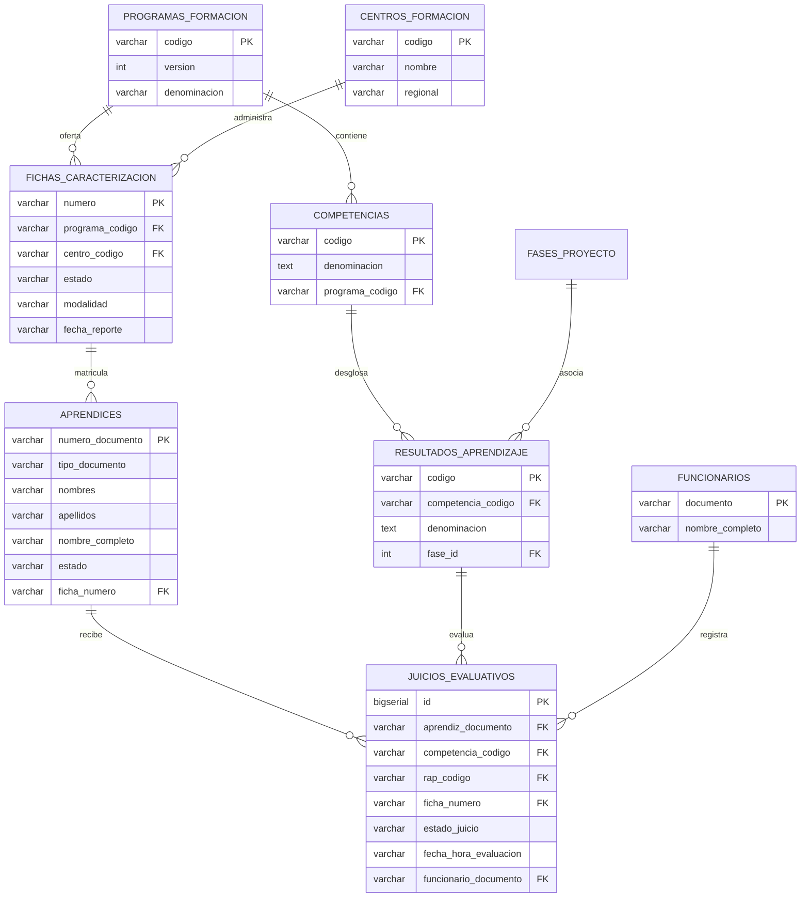

# Base de Datos Relacional PostgreSQL (3FN)

El sistema se encuentra 100% conectado a un motor de base de datos **PostgreSQL 17** real en entorno local, eliminando cualquier dependencia de `localStorage` para el almacenamiento de los datos de negocio.

---

## 1. Parámetros de Conexión Local
- **Motor:** PostgreSQL 17.6 (x86_64)
- **Base de Datos:** `sena_juicios_db`
- **Host:** `localhost`
- **Puerto:** `5432`
- **Usuario:** `postgres`
- **Contraseña:** `123456`

---

## 2. Esquema Relacional de Tablas (3FN)

---

## 3. Poblado y Verificación de Tablas Físicas

La base de datos fue inicializada y migrada ejecutando `node server/db/initDb.js`. El estado actual de los registros físicos en PostgreSQL es:

| Tabla | Registros Físicos | Descripción |
| :--- | :---: | :--- |
| `fichas_caracterizacion` | **2** | Ficha 3407847 (Ganadería) y Ficha 3389756 (Gestión Contable) |
| `aprendices` | **42** | Aprendices con documento, nombres y estados de formación |
| `competencias` | **26** | Normas de competencia curricular |
| `resultados_aprendizaje` | **184** | RAPs asociados a las competencias |
| `juicios_evaluativos` | **3.808** | Calificaciones individuales con instructor y fecha/hora |
| `fases_proyecto` | **4** | Análisis, Planeación, Ejecución y Evaluación |

---

## 4. API REST Backend (Express)
El servidor Express (`server/index.js`) opera en `http://localhost:3001` y expone los siguientes endpoints que consultan directamente a PostgreSQL:

- **`GET /api/fichas`:** Devuelve las fichas y calcula en tiempo real con queries SQL los totales de aprendices, juicios y avance porcentual.
- **`GET /api/fichas/:numero`:** Extrae mediante `SELECT` relacionales la sábana completa de la ficha con aprendices, RAPs y juicios.
- **`POST /api/fichas/importar`:** Realiza inserciones transaccionales seguras (`BEGIN / COMMIT / ROLLBACK`) al procesar un nuevo reporte de Sofia Plus.
- **`DELETE /api/fichas/:numero`:** Elimina la ficha y en cascada sus aprendices y juicios asociados en PostgreSQL.
- **`PUT /api/raps/:codigo/fase`:** Actualiza la fase de un resultado de aprendizaje en la tabla `resultados_aprendizaje`.
- **`POST /api/sql/execute`:** Permite ejecutar consultas SQL SELECT en vivo contra PostgreSQL desde la consola interactiva.
